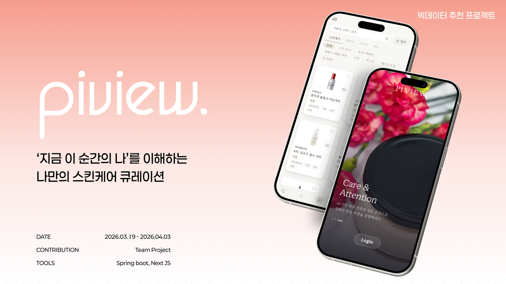
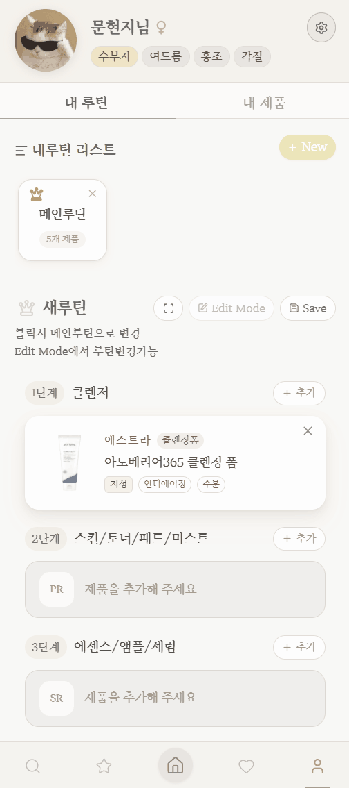
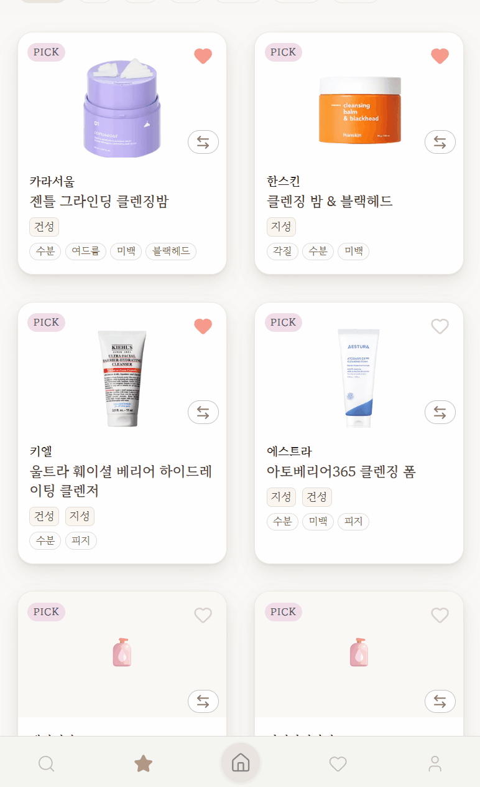
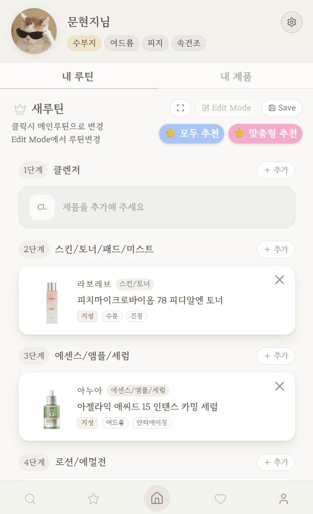
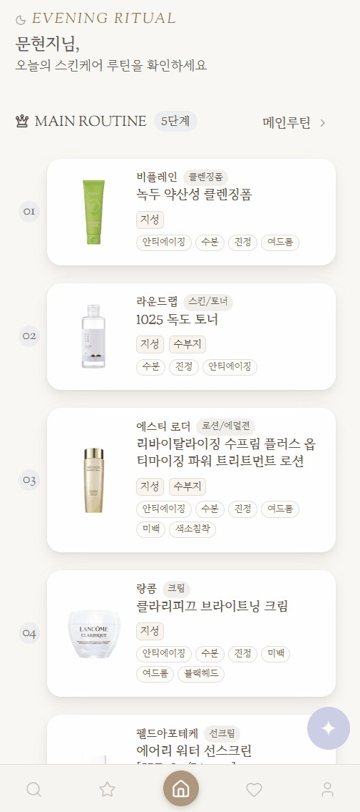
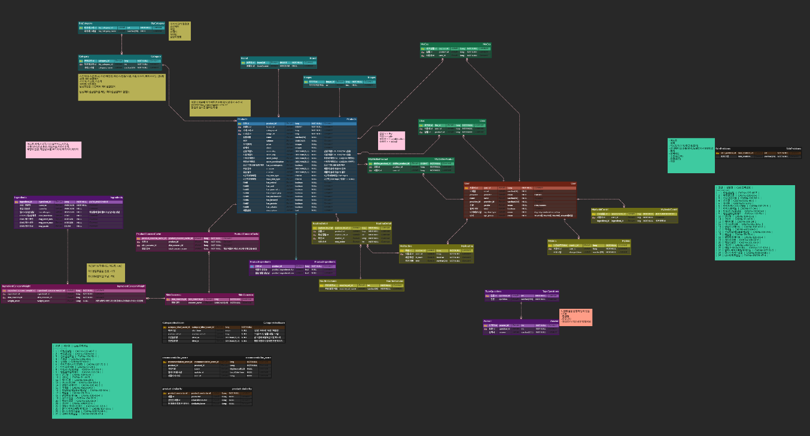
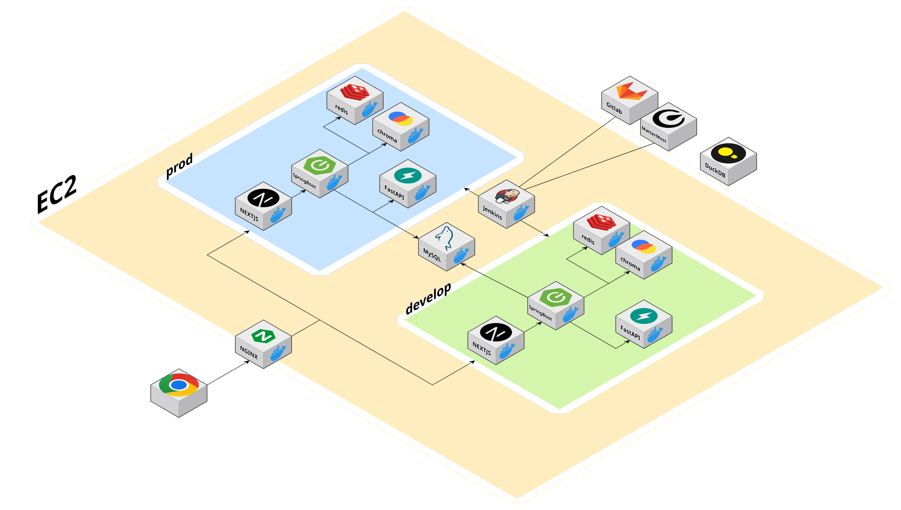
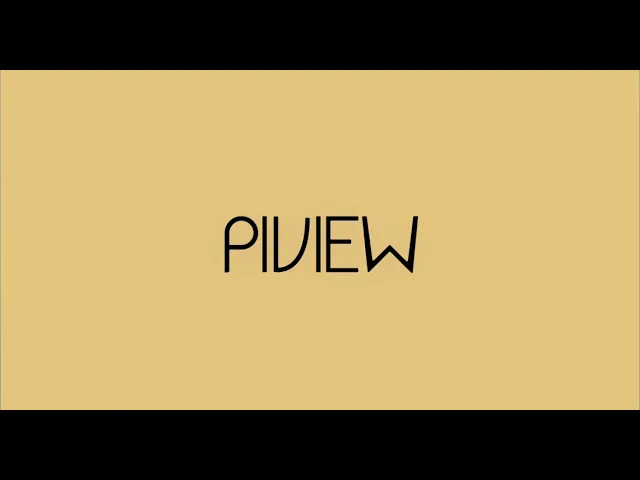

<h1 align="center">

<span style="color:#F69D8D;">PiView</span>
</h1>


<p align="center">
  <b>🏆 SSAFY 특화 프로젝트 최우수상 수상</b>
</p>

<br/>

<p align="center">
  <b>내 피부를 가장 잘 아는</b><br/>
  <b>나만의 맞춤형 스킨케어 큐레이션</b>
</p>

<br/>

<p align="center">
  피부 타입 분석부터 화장품 추천, 루틴 관리까지<br/>
  <b>스마트 뷰티 플랫폼, 피뷰(Piview)</b>
</p>

<br/>


<p align="center">
  
</p>

<br/>

## 📑 목차

<br/>

<p align="center">
  <a href="#project-info"><b>🚀 프로젝트 정보</b></a> &nbsp;&nbsp;|&nbsp;&nbsp;
  <a href="#team"><b>👥 Team</b></a> &nbsp;&nbsp;|&nbsp;&nbsp;
  <a href="#why-piview"><b>💬 PiView를 만든 이유</b></a> &nbsp;&nbsp;|&nbsp;&nbsp;
  <a href="#features"><b>✨ 주요 기능</b></a> &nbsp;&nbsp;|&nbsp;&nbsp;
  <a href="#structure"><b>📂 프로젝트 구조</b></a> <br><br>
  <a href="#core-pipeline"><b>⚙️ 코어 파이프라인</b></a> &nbsp;&nbsp;|&nbsp;&nbsp;
  <a href="#tech-stack"><b>🛠 기술 스택</b></a> &nbsp;&nbsp;|&nbsp;&nbsp;
  <a href="#docs"><b>📄 개발 상세 문서</b></a> &nbsp;&nbsp;|&nbsp;&nbsp;
  <a href="#data-modeling"><b>ERD</b></a> <br><br>
  <a href="#architecture"><b>System Architecture</b></a> &nbsp;&nbsp;|&nbsp;&nbsp;
  <a href="#demo"><b>🎬 Demo Video</b></a>
</p>

<br/>


## 🚀 프로젝트 정보 <a id="project-info"></a>


| 항목 | 상세 내용 |
|:---:|:---|
| 🗓️ **진행 기간** | 2026.02.23 ~ 2026.03.30 (약 5주) |
| 💻 **플랫폼** | Web App (PWA) |
| 👥 **개발 인원** | 6명 |
| 🏢 **기 관** | 삼성 청년 SW·AI 아카데미 SSAFY 14기 |

<br/>


## 👥 Team <a id="team"></a>


<div align="center">

<table align="center">
    <tr>
        <td width="33%" align="center">
            
            <br/> <b>김가민</b> <br/><sub>Team Lead / Infra / BE</sub>
        </td>
        <td width="33%" align="center">
            
            <br/> <b>김상지</b> <br/><sub>AI / BE</sub>
        </td>
        <td width="33%" align="center">
            
            <br/> <b>문현지</b> <br/><sub>FE / Design</sub>
        </td>
    </tr>
    <tr>
        <td width="33%" valign="top">
            <sub>
                - 프로젝트 총괄<br/>
                - Docker Compose·Nginx 기반 Dev/Prod 환경 및 HTTPS·Swagger 라우팅 설정<br/>
                - Redis·MySQL·DuckDB·Chroma 기반 서비스 환경 및 컨테이너 설정 구현<br/>
                - 화장품 추천 API 및 루틴 단계별/멀티 추천 로직 구현<br/>
                - 비적합 제품·문제 성분 반영 추천 로직 및 피부 타입·카테고리 기반 추천 구조 구현<br/>
                - DuckDB 기반 이벤트 로그 배치 및 추천 점수·연관 상품 동기화 구현<br/>
                - OAuth2·Security 설정 및 인증/리다이렉트 경로 설정 반영
            </sub>
        </td>
        <td width="33%" valign="top">
            <sub>
                - JWT 기반 인증 필터 및 토큰 재발급·로그아웃 API 구현<br/>
                - OAuth2(Kakao) 로그인, 쿠키 릴레이, 하이브리드 인증 구조 구현<br/>
                - SecurityConfig·WebMvc·Swagger 인증 경로 및 개발용 토큰 설정 반영<br/>
                - Redis 기반 임시 루틴 저장 및 루틴 추가·조회·수정 로직 구현<br/>
                - 메인 루틴 조회·관리 및 루틴 응답 구조 개선<br/>
                - 제품 좋아요 API 및 화장품 통합 검색 API 구현<br/>
                - 외부 AI 연동 기반 제품 요약·비교 분석 API 및 비동기 처리 구현<br/>
                - FastAPI, EasyOCR, GMS 연동 기반 화장품 OCR 인식 및 AI 텍스트 정제 파이프라인 구축
            </sub>
        </td>
        <td width="33%" valign="top">
            <sub>
                - 마이페이지·홈·추천·검색·상품 상세 화면 Figma로 UI 구현<br/>
                - ProductCard·RoutineTab·OwnedTab·RoutineAddModal 등 재사용 가능한 공통 컴포넌트 설계·구현 및 TypeScript 기반 props 타입 정의를 통한 타입 안전성 확보, shadcn/ui + Radix UI 활용 접근성 개선<br/>
                - 보유제품·기피제품·피부타입·피부고민 조회/수정 API 연동, 임시 루틴 이동 및 루틴 기반 제품 추천 기능 개발<br/>
                - 성분 비교 모달·AI 챗봇 UI·제품 태그·하단 네비게이션 디자인 개선 및 Zustand를 활용한 전역 상태 기반 UI 인터랙션 구현<br/>
                - 모바일 퍼스트 반응형 레이아웃 구현, CSS transition 기반 버튼 애니메이션 적용, Next.js App Router 라우팅 관련 뒤로가기 오류 디버깅 및 수정
            </sub>
        </td>
    </tr>
    <tr>
        <td width="33%" align="center">
            
            <br/> <b>박승찬</b> <br/><sub>BE</sub>
        </td>
        <td width="33%" align="center">
            
            <br/> <b>전희수</b> <br/><sub>AI / BE</sub>
        </td>
        <td width="33%" align="center">
            
            <br/> <b>최현웅</b> <br/><sub>AI / FE</sub>
        </td>
    </tr>
    <tr>
        <td width="33%" valign="top">
            <sub>
                - 제품 엔티티·리포지토리 및 상품 조회 API 구조 구현<br/>
                - 대카테고리·카테고리·브랜드·피부고민 태그 메타데이터 API 구현<br/>
                - 상품 목록 조회·필터링·통합 검색 쿼리 및 ProductCatalogService 로직 구현<br/>
                - ProductRepositoryImpl 기반 조회 쿼리 최적화 및 native SQL 적용<br/>
                - 상품 피부고민 태그 매핑 및 ProductConcernCache 기반 응답 구조 반영<br/>
                - 상품 비교 API 및 성분·EWG·알레르기 비교 로직 구현
            </sub>
        </td>
        <td width="33%" valign="top">
            <sub>
                - 피부 설문/피부 분석 기능 및 백엔드-AI 연동 개발<br/>
                - 챗봇 기능 개발 및 RAG 검색 구조 구현<br/>
                - 상품 검색 파이프라인 및 검색어 해석 로직 구현<br/>
                - Chroma·Redis 기반 검색/세션 환경 연동 구현<br/>
                - 사용자 프로필 조회·수정 API 구현<br/>
                - 안 맞는 제품 등록·조회·삭제 및 문제 성분 관리 API 구현<br/>
                - README, AGENTS, Swagger 문서 정리
            </sub>
        </td>
        <td width="33%" valign="top">
            <sub>
                - React/Next 기반 퍼블리싱 및 주요 화면 UI 구현<br/>
                - 검색·추천·상품 상세·좋아요·마이페이지 화면 개발<br/>
                - ProductCard·CompareModal·CategoryFilter 등 공통 UI 컴포넌트 구현 및 개선<br/>
                - 피부 설문 플로우 및 상세·검색 API 연동 화면 처리<br/>
                - 루틴 추가 모달·OCR 뷰파인더·챗봇 제품 카드 등 사용자 인터랙션 기능 수정<br/>
                - 카테고리 필터·페이징·이미지 최적화·PWA 등 프론트 기능 개선<br/>
                - 스킨케어 성분 DB · 제품 데이터 크롤링 및 성분 기반 피부타입 분류 알고리즘 설계<br/>
                - AI 루틴 분석 설계 및 구현 — 피부 데이터 구조화 및 Gemini 프롬프트 엔지니어링
            </sub>
        </td>
    </tr>
</table>

</div>

<br>

## 💬 PiView를 만든 이유 <a id="why-piview"></a>

화장품을 고르는 일은 생각보다 단순하지 않습니다. 같은 수분크림이라도 피부 타입이 어떤지, 민감도는 어떤지, 피하고 싶은 성분이 있는지, 이미 쓰고 있는 제품과 충돌하지는 않는지에 따라 잘 맞는 제품이 달라집니다.

기존 탐색 방식은 대체로 리뷰 중심이거나 단일 제품 중심입니다.

- 피부 상태를 정량적으로 반영하기 어렵습니다.
- 사용자의 회피 성분과 선호를 구조화해 반영하기 어렵습니다.
- 이미 사용 중인 제품들과의 궁합까지 고려하기 어렵습니다.
- 검색 결과는 많지만, 왜 이 제품이 나에게 맞는지 설명이 약합니다.

PiView는 이 문제를 해결하기 위해 피부 분석, 설문 기반 보정, 성분 분석, 제품 비교, 보유 제품 관리, 루틴 구성을 하나의 흐름으로 연결했습니다.

</br>

## ✨ 주요 기능 <a id="features"></a>

<table width="100%">
  <tr>
    <td width="33%" align="center"><b>AI 피부 진단</b></td>
    <td width="33%" align="center"><b>OCR 보유 제품 등록</b></td>
    <td width="33%" align="center"><b>제품 상세보기 및 AI 분석</b></td>
  </tr>
  <tr>
    <td align="center">
      
    </td>
    <td align="center">
      
    </td>
    <td align="center">
      
    </td>
  </tr>

  <tr>
    <td width="33%" align="center"><b>제품 비교 및 AI 분석</b></td>
    <td width="33%" align="center"><b>AI루틴 분석</b></td>
    <td width="33%" align="center"><b>제품 충돌 알림</b></td>
  </tr>
  <tr>
    <td align="center">
      
    </td>
    <td align="center">
      
    </td>
    <td align="center">
      
    </td>
  </tr>

  <tr>
    <td width="33%" align="center"><b>AI 추천제품</b></td>
    <td width="33%" align="center"><b>챗봇</b></td>
    <td width="33%" align="center"><b>메인 루틴</b></td>
  </tr>
  <tr>
    <td align="center">
      
    </td>
    <td align="center">
      
    </td>
    <td align="center">
      
    </td>
  </tr>
</table>

<br>

## 📂 프로젝트 구조 <a id="structure"></a>


```text
S14P21E101/
├── frontend/            # Next.js 16 웹 (온보딩 · 추천 · 검색 · 마이페이지)
├── backend/             # Spring Boot API 서버 (Java 21)
├── ai/                  # FastAPI AI 서버 (피부 분석 · OCR · 챗봇 · 검색)
├── nginx/               # 리버스 프록시 및 라우팅 설정
├── docs/                # 아키텍처 문서 · 이미지 · 데모 GIF
├── docker-compose.yml   # 프론트엔드·백엔드·AI·인프라 컨테이너 구성
└── init.sql             # MySQL 초기 데이터베이스 생성 스크립트
```

<details>
<summary><b>Frontend</b></summary>

```
frontend/src/
├── app/                     # Next.js App Router
│   ├── (main)/              # home · recommend · search · likes · mypage
│   ├── (onboarding)/        # splash · welcome · skin-test
│   ├── product/[id]/        # 상품 상세
│   └── oauth2/              # OAuth2 리다이렉트 처리
├── components/
│   ├── common/              # 공통 컴포넌트
│   ├── features/            # home · search · product · mypage · onboarding
│   ├── layout/              # 레이아웃 · 네비게이션
│   └── ui/                  # shadcn/ui + Radix UI 기반 UI
├── hooks/                   # 커스텀 훅
├── services/               # API 호출 모듈
├── stores/                 # Zustand 전역 상태
├── types/ · constants/      # 타입 정의 · 상수
├── lib/ · utils/            # 유틸 · 설정
└── public/                  # 정적 자원 · PWA 매니페스트
```

</details>

<details>
<summary><b>Backend</b></summary>

```
backend/src/main/java/com/piview/backend/
├── domain/                  # 도메인별 패키지
│   ├── user/                # 사용자 · 프로필 · 피부 정보
│   ├── skin/                # 피부 설문 · 피부 분석
│   ├── product/             # 제품 조회 · 검색 · 비교
│   ├── routine/             # 스킨케어 루틴 관리
│   ├── chatbot/             # 챗봇 질의 연동
│   └── ocr/                 # OCR 제품 인식 연동
├── global/                  # 공통 모듈
│   ├── config/              # 설정 (Web · Swagger 등)
│   ├── security/            # JWT · OAuth2 · Security
│   ├── redis/               # Redis 세션·캐시
│   ├── exception/           # 전역 예외 처리
│   └── util/                # 공통 유틸
└── BackendApplication.java  # Spring Boot 엔트리포인트
```

</details>

<details>
<summary><b>AI</b></summary>

```
ai/
├── main.py                  # FastAPI 엔트리포인트
├── api/routers/             # API 엔드포인트
│   ├── skin_type.py         # 피부 타입 분석
│   ├── ocr.py               # 화장품 OCR 인식
│   ├── chatbot.py           # 챗봇 응답
│   └── product_search.py    # 상품 검색
├── services/                # 핵심 비즈니스 로직
│   ├── skin/                # 피부 분석 파이프라인
│   ├── chatbot/             # intent · retrieval · generation · session 등 RAG 구성
│   └── product_search/      # 상품 검색 파이프라인
├── inference/               # 모델 추론 (전체 얼굴 · 국소 부위 · 수분)
├── preprocessing/           # MediaPipe 기반 얼굴 ROI 추출
├── decision/                # 피부 타입 판정 로직
├── prompts/                 # LLM 프롬프트
├── schemas/ · core/         # 스키마 · 설정
├── models/                  # 학습된 모델 가중치 (Git 제외)
└── tests/ · scripts/        # 테스트 · 유틸 스크립트
```

</details>

<br>

## ⚙️ 코어 파이프라인 <a id="core-pipeline"></a>


피뷰(Piview)는 정확한 진단, 정교한 추천, 그리고 스마트한 탐색을 위해 3가지 핵심 AI 파이프라인을 운영합니다.

<br/>

### 1. AI 피부 진단 파이프라인
> 얼굴 이미지 추론 데이터와 사용자 설문 응답을 결합하여, 가장 정확한 현재 피부 상태를 도출합니다.

* **Step 1. 입력 정리** 얼굴 사진(모델 추론용)과 설문 응답(체감 정보 및 생활 습관 신호)을 하나의 사용자 컨텍스트로 묶어 분석을 준비합니다.
* **Step 2. 얼굴 영역(ROI) 추출** `MediaPipe`를 활용해 이마, 양 볼 등 부위별 분석에 필요한 얼굴 영역을 추출하고 정렬합니다. 사진의 구도가 달라도 일관된 기준으로 부위를 잘라내어 추론의 정확도를 높입니다.
* **Step 3. AI 모델 추론** * **전체 얼굴:** `EfficientNet-B0` 적용
    * **국소 부위:** `ConvNeXt-Tiny`, `EfficientNet-B2` 적용
    * 유/수분감이 부위별로 다를 수 있으므로, 얼굴 전체의 흐름과 국소 부위의 특징을 분리하여 정밀하게 분석합니다.
* **Step 4. 설문 보정 및 최종 결과 생성** 사진 추론 결과에 설문 응답을 보정 신호로 결합합니다. 이렇게 완성된 피부 상태 정보는 추천, 검색, 필터링의 핵심 기준으로 사용됩니다.

<br/>

### 2. 개인화 추천 파이프라인
> 피부 타입, 루틴의 밸런스, 성분 충돌, 그리고 사용자의 행동 로그까지 종합적으로 분석하여 최적의 제품을 제안합니다.

* **Step 1. 추천 컨텍스트 구성**
  피부 타입, 주요 고민, 회피 성분, 안 맞는 제품, 현재 루틴 상태를 종합하여 추천의 기준점을 설정합니다.
* **Step 2. 1차 후보 필터링 (Hard Filter)**
    * 피부 타입에 맞지 않거나, 회피/알레르기 성분이 포함된 제품 제외
    * 지성/수부지의 경우 트러블 유발 가능성(모공 막힘 등)이 높은 제품 엄격히 필터링
    * 현재 루틴에 이미 포함된 제품 제외
* **Step 3. 기본 적합도 스코어링**
  사용자의 **피부 타입**과 **현재 피부 고민**에 얼마나 부합하는지를 기준으로 가산점을 부여합니다.
* **Step 4. 스킨케어 루틴 밸런스 보정**
  단일 제품의 스펙뿐만 아니라 현재 루틴과의 조화를 분석합니다. 각 루틴 단계에서 기대하는 **유/수분 균형**을 계산하여, 부족한 부분을 잘 채워주는 제품에 높은 점수를 부여합니다.
* **Step 5. 성분 충돌 필터링 (Safety Check)**
  같이 사용하면 위험한 성분 조합(예: `레티놀 ↔ 산성 각질제거제 / 순수 비타민C`)을 감지하여 강력한 페널티를 부여합니다.
* **Step 6. 동적 행동 로그 반영 (User Interaction)**
  주기적으로 집계된 행동 로그를 스코어에 반영합니다. (`좋아요(강) > 상세페이지 조회(중) > 검색 노출(약)`)
* **Step 7. 최종 랭킹 정렬**
  기본 적합도, 루틴 밸런스, 성분 안전성, 행동 로그를 모두 수치화하여 최종 우선순위 목록을 사용자에게 제공합니다.

<br/>

### 3. 챗봇 응답 파이프라인 (RAG & NLP)
> 사용자의 자연어 질의를 해석하고, 벡터 검색과 키워드 검색을 병행하여 맞춤형 제품 정보와 추천 이유를 설명합니다.

* **Step 1. 자연어 질의 입력**
  단순한 대화가 아닌, 제품 탐색과 추천 이유 설명에 특화된 인터페이스로 질의를 수집합니다.
* **Step 2. 의도 및 조건 추론 (NLP Processing)**
    * 질문을 `추천 요청형`, `정보 설명형`, `기본 안내형`으로 분류합니다.
    * `kiwipiepy`로 형태소를 분석하고, `RapidFuzz`를 통해 오타와 표현의 흔들림을 교정합니다.
    * 영어/한국어 혼용 표현(`toner` -> `토너`)을 정규화하며, 현재 화면의 문맥(카테고리, 피부 고민 등)을 함께 파악합니다.
* **Step 3. 하이브리드 멀티 검색 (Retrieval)**
    * **벡터 검색:** `ChromaDB`를 활용해 질문의 의미(Semantic)와 유사한 제품 탐색
    * **키워드 검색:** 상품명, 브랜드 등 명시적인 텍스트 조건 매칭
    * **퍼지 검색:** 오타 보정 및 연관 후보 확장
* **Step 4. 생성형 응답 조합 (Generation)**
  단순한 검색 결과 나열을 넘어, 검색된 데이터를 근거로 제품의 추천 이유와 비교 요약을 사람이 읽기 쉬운 자연어로 생성합니다. (검색 근거가 부족할 경우 Fallback 응답 제공)
* **Step 5. 최종 응답 반환**
  이전 대화의 맥락을 유지하면서, 제품 정보와 스마트한 추천 이유가 결합된 최종 답변을 사용자에게 제공합니다.


## 🛠 기술 스택 <a id="tech-stack"></a>


### 🎨 Frontend
<p align="center">
  
  
  
  
  
  
  
  
</p>

<br/>

<div align="center">

| Category | Spec |
| --- | --- |
| Language | TypeScript |
| Package Manager | pnpm 10 |
| Framework | Next.js 16, React 19 |
| Libraries | TanStack Query 5.90, Axios 1.13, Zustand 5, Framer Motion 12 |
| UI | Radix UI, shadcn/ui, Lucide React |
| Styling | Tailwind CSS 4 |
| PWA | @ducanh2912/next-pwa 10.2.9 |
| Build Tool | Next.js (Turbopack / Webpack) |
| IDE | VS Code |

</div>


### 🔖 Backend
<p align="center">
  
  
  
  
  
  
  
  
  
  
  
</p>

<br/>

<div align="center">

| Category | Spec |
|:--:|:--|
| Language | Java 21 |
| Framework | Spring Boot 3.5.11 |
| Core Libraries | Spring Security, Spring Batch, Spring Data JPA, QueryDSL, JWT, OAuth2 |
| API Docs | Springdoc OpenAPI (Swagger) |
| Database | MySQL, Redis |
| Vector / OLAP DB | Chroma DB, DuckDB |
| Build Tool | Gradle |
| IDE | IntelliJ IDEA |

</div>


### 📈 AI
<p align="center">
  
  
  
  
  
  
  
</p>

<br/>

| Category | Spec |
| --- | --- |
| LLM Model | Gemini 계열 모델 (FastAPI OCR/챗봇 기본 `gemini-2.5-flash`, Backend 상품 요약·상품 비교·루틴 분석 `gemini-2.5-flash-lite`) |
| OCR & Vision | EasyOCR, OpenCV, PaddleOCR |
| Skin Analysis | PyTorch, MediaPipe Face Landmarker, EfficientNet-B0, ConvNeXt-Tiny, EfficientNet-B2 |
| Embedding & Vector Search | GMS OpenAI-compatible Embeddings (`text-embedding-3-small`), ChromaDB |
| Search Engine | MySQL Keyword Search, Exact Search, Fuzzy Search |
| Session & Cache | Redis / In-memory Chat Session, Redis 기반 피부 분석 상태 캐싱 |
| Algorithm | Bounding Box Height Sorting, OCR Confidence Filtering, Levenshtein Distance (DP), Dynamic Weighted Matching, Hybrid Retrieval (Vector + Keyword + Exact/Fuzzy), Structured Query Parsing & Reranking |


### 🗃️ DevOps

<p align="center">
  
  
  
  
  
  
  
</p>

<br/>

<div align="center">

| **Category** | **Spec** |
| --- | --- |
| **Instance** | AWS EC2 (Ubuntu 20.04) |
| **Container** | Docker, Docker Compose |
| **CI/CD** | GitLab, Jenkins (Publish over SSH) |
| **Frontend** | Next.js 16, React 19 |
| **Backend** | Java 21 (Eclipse Temurin), Spring Boot 3.5.11 |
| **Database (Main)** | MySQL |
| **Database (Vector)** | ChromaDB |
| **Database (Batch)** | DuckDB (Embedded) |
| **AI / External API** | Google Gemini (`gemini-2.5-flash`, `gemini-2.5-flash-lite`) |
| **Security** | JWT (JSON Web Token) |
| **Version Control** | Git, GitLab (Monorepo Architecture) |


</div>

<br>


### Collaboration Tools


<p align="center">


</p>

<br>
<br>

## 📄 개발 상세 문서 <a id="docs"></a>


루트 README에서는 PiView의 전체 흐름을 먼저 볼 수 있고, 더 자세한 구조와 설계는 `docs/architecture/` 아래 문서에서 이어서 확인할 수 있습니다.
실제 공개 경로, 외부 설정 파일, 서비스 연결 방식은 환경과 배포 설정에 따라 달라질 수 있습니다.
<br/>

<table width="100%">
  <tr>
    <td width="30%" align="center"><b>요구사항 정의서</b></td>
    <td width="70%" align="center">
      <a href="https://candle-aster-a91.notion.site/3147417ec6f68065a599ea58f2012e6b?v=3147417ec6f6814a9b38000c1c27598e&source=copy_link">Notion 바로가기</a>
    </td>
  </tr>
  <tr>
    <td align="center"><b>아키텍처 인덱스</b></td>
    <td align="center">
      <a href="docs/architecture/README.md">docs/architecture/README.md</a>
    </td>
  </tr>
  <tr>
    <td align="center"><b>시스템 개요</b></td>
    <td align="center">
      <a href="docs/architecture/overview/system-overview.md">docs/architecture/overview/system-overview.md</a>
    </td>
  </tr>
  <tr>
    <td align="center"><b>Frontend 구조</b></td>
    <td align="center">
      <a href="docs/architecture/frontend/app-structure.md">docs/architecture/frontend/app-structure.md</a>
    </td>
  </tr>
  <tr>
    <td align="center"><b>Backend 도메인 맵</b></td>
    <td align="center">
      <a href="docs/architecture/backend/domain-map.md">docs/architecture/backend/domain-map.md</a>
    </td>
  </tr>
  <tr>
    <td align="center"><b>AI 서비스 맵</b></td>
    <td align="center">
      <a href="docs/architecture/ai/service-map.md">docs/architecture/ai/service-map.md</a>
    </td>
  </tr>
  <tr>
    <td align="center"><b>Infra 배포 구조</b></td>
    <td align="center">
      <a href="docs/architecture/infra/deployment-layout.md">docs/architecture/infra/deployment-layout.md</a>
    </td>
  </tr>
</table>

<br/><br/>

## ERD<a id="data-modeling"></a>

<p align="center">
  
</p>

<br/>

## System Architecture <a id="architecture"></a>

<p align="center">
  
</p>

<br/><br/>

## 🎬 Demo Video <a id="demo"></a>

<p align="center">
  <a href="https://youtu.be/IUG-SGhTQUk">
    
    <br/>
    <b>▶️ 영상 포트폴리오 보러가기 (YouTube)</b>
  </a>
</p>