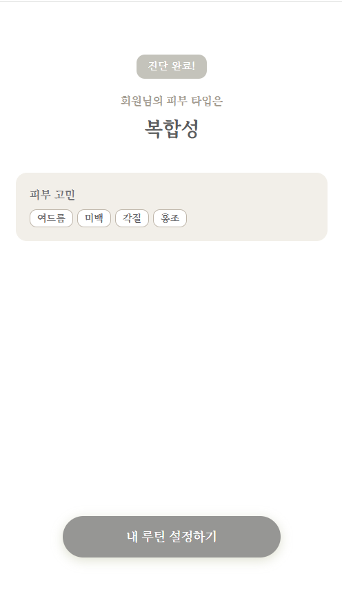
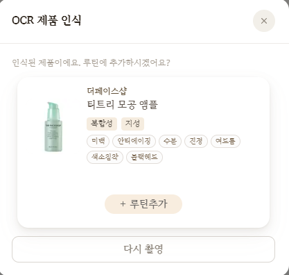
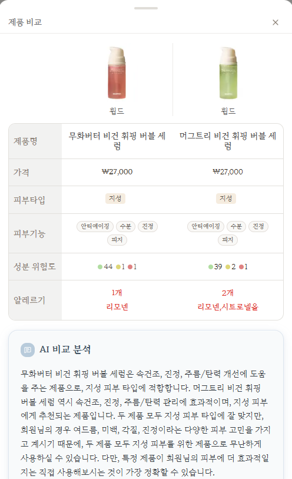
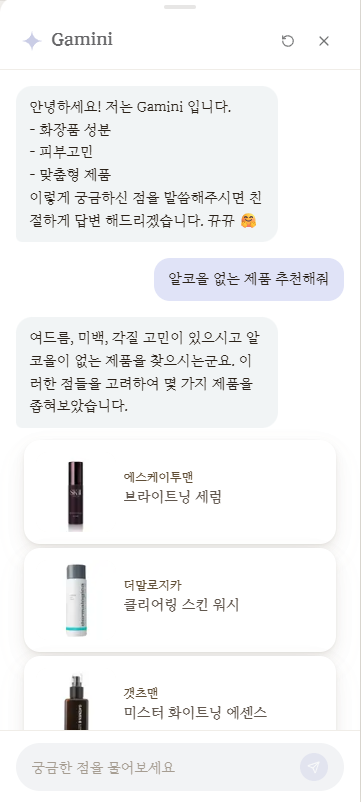
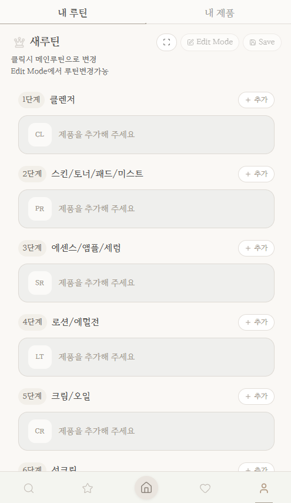

# PiView

> 피부를 보다, 피부를 리뷰하다

### 팀

- FE: 문현지, 최현웅
- AI: 최현웅, 김상지, 전희수
- BE: 김상지, 박승찬, 전희수, 김가민
- Infra: 김가민
- Data: 김가민, 최현웅, 김상지

## 프로젝트 개요

PiView는 얼굴 사진 기반 피부 진단, 보유 제품 관리, 루틴 구성을 하나의 흐름으로 연결하는 맞춤형 화장품 큐레이션 서비스입니다.

한 제품을 따로 추천하는 데서 끝나지 않고, 사용자 피부 정보와 지금 쓰고 있는 제품 맥락까지 함께 반영해 루틴 중심으로 선택을 도와주는 방향으로 만들고 있습니다.

## 프로젝트 구조

```text
.
├─ frontend/               # 사용자 화면, 온보딩, 탐색, 추천, 마이페이지, 상태 관리
├─ backend/                # 인증, 도메인 로직, 제품/루틴 API, 추천 오케스트레이션, 데이터 관리
├─ ai/                     # 피부 분석, OCR, 자연어 질의 해석, 검색 보조, 챗봇 보조
├─ nginx/                  # 리버스 프록시 및 라우팅 설정
├─ docs/
│  └─ architecture/        # 시스템 개요와 계층별 상세 설계 문서
├─ docker-compose.yml      # 프론트엔드, 백엔드, AI, 인프라 컨테이너 구성
└─ init.sql                # MySQL 초기 데이터베이스 생성 스크립트
```

## 왜 PiView인가

화장품을 고르는 일은 생각보다 단순하지 않습니다. 같은 수분크림이라도 피부 타입이 어떤지, 민감도는 어떤지, 피하고 싶은 성분이 있는지, 이미 쓰고 있는 제품과 충돌하지는 않는지에 따라 잘 맞는 제품이 달라집니다.

기존 탐색 방식은 대체로 리뷰 중심이거나 단일 제품 중심입니다.

- 피부 상태를 정량적으로 반영하기 어렵습니다.
- 사용자의 회피 성분과 선호를 구조화해 반영하기 어렵습니다.
- 이미 사용 중인 제품들과의 궁합까지 고려하기 어렵습니다.
- 검색 결과는 많지만, 왜 이 제품이 나에게 맞는지 설명이 약합니다.

PiView는 이 문제를 해결하기 위해 피부 분석, 설문 기반 보정, 성분 분석, 제품 비교, 보유 제품 관리, 루틴 구성을 하나의 흐름으로 연결했습니다.

## 핵심 기능

### AI 피부 진단



피부 진단은 얼굴 사진 한 장으로 피부를 단순 분류하는 데서 멈추지 않습니다. 얼굴 전체와 부위별 상태를 함께 읽고, 설문에서 얻은 생활 습관과 체감 정보까지 묶어서 이후 추천과 검색의 출발점이 되는 피부 상태 정보를 만듭니다.

진단 결과가 한 번 보고 끝나는 화면이 아니라, 탐색과 추천의 출발점이 되는 정보로 이어지도록 연결했습니다.

### OCR 기반 보유 제품 등록



보유 제품 등록은 생각보다 손이 많이 갑니다. 제품명을 찾고 입력하는 순간부터 흐름이 끊기기 쉬워서, PiView는 이 과정을 사진 업로드 중심으로 풀었습니다.

사용자는 손에 있는 제품을 빠르게 서비스 안으로 옮길 수 있고, 시스템은 그 결과를 실제 제품 데이터와 연결해 루틴 구성과 추천 판단에 바로 반영합니다.

### 개인화 추천과 동적 점수 계산

추천은 결국 "지금 이 사용자에게 어떤 제품이 더 맞는가"를 정하는 문제입니다. PiView는 인기 제품을 그대로 보여주기보다, 사용자의 피부 상태와 회피 조건, 보유 제품과 현재 루틴 맥락을 함께 보면서 추천 순서를 다시 계산합니다.

같은 제품이라도 누구에게 보여주느냐, 또 어떤 조합 안에서 보느냐에 따라 결과가 달라질 수 있어야 한다고 봤습니다. 그래서 추천도 단순히 목록을 보여주는 기능보다, 지금 맥락에 맞게 순서를 다시 정리하는 방식에 가깝게 만들었습니다.

### 제품 비교와 AI 요약



추천 이후에는 늘 "그래서 둘 중 뭘 고르지?"라는 순간이 남습니다. PiView는 이 구간에서 제품 비교와 AI 요약을 함께 제공합니다.

성분, 효능, 적합도 차이를 계산해서 보여주는 것만으로는 부족할 수 있어서, 현재 사용자 조건에서 어떤 차이가 실제 선택에 더 중요한지까지 짧게 보여주도록 했습니다.

### 챗봇과 검색 결합형 응답



PiView의 챗봇은 아무 주제나 대화하는 범용 챗봇이라기보다, 제품 탐색과 추천 설명을 더 편하게 풀어주는 인터페이스에 가깝습니다.

말투만 자연스러운 응답을 만드는 것이 목적은 아닙니다. 검색의 근거를 놓치지 않으면서도, 사용자가 추천 이유와 제품 정보를 부담 없이 이해할 수 있게 풀어주는 쪽에 더 가깝습니다.

### 보유 제품과 루틴 관리



PiView에서 보유 제품과 루틴은 부가 기능이 아니라, 추천을 실제 선택으로 이어지게 만드는 요소입니다. 지금 내가 이미 갖고 있는 제품과 어떻게 조합되는지를 모르면 추천도 현실감이 떨어질 수 있습니다.

그래서 사용자가 조합을 자주 바꿔보는 과정과, 최종적으로 루틴을 확정해 저장하는 과정을 모두 자연스럽게 지원하도록 했습니다. 추천이 실제 사용 흐름 안에서 이어지도록 받쳐주는 영역이기도 합니다.

## 파이프라인

### AI 피부 진단 파이프라인

1. 입력 정리 단계  
얼굴 사진과 설문 응답을 같은 사용자 컨텍스트로 묶어 분석 입력을 정리합니다. 사진은 모델 추론용 입력으로, 설문은 이미지에서 바로 드러나지 않는 체감 정보와 생활 습관 신호로 사용합니다.

2. 얼굴 영역 추출 단계  
`MediaPipe` 기반 ROI 추출을 통해 이마와 양 볼 등 부위별 분석에 필요한 얼굴 영역을 정렬합니다. 얼굴 위치와 각도가 달라도 같은 기준으로 부위를 잘라낼 수 있어, 이후 추론 결과의 흔들림을 줄이는 역할을 합니다.

3. 모델 추론 단계  
얼굴 전체에는 `EfficientNet-B0`, 부위별 분석에는 `ConvNeXt-Tiny`, `EfficientNet-B2` 계열 모델을 적용해 피부 타입 축과 상태 신호를 계산합니다. 얼굴 전체 흐름과 부위별 특징을 나눠 보는 이유는, 같은 사용자라도 부위마다 유분감과 수분감이 다르게 나타날 수 있기 때문입니다.

4. 설문 보정 및 결과 생성 단계  
사진 추론 결과에 설문 응답을 그대로 덮어쓰지 않고 보정 신호로 결합합니다. 이렇게 만든 최종 피부 상태 정보는 추천, 검색, 필터링에서 함께 참고하는 기준으로 사용됩니다.

### 개인화 추천 파이프라인

1. 추천 입력 구성 단계  
사용자의 **피부 타입**, **주요 피부 고민**, **회피 성분**, **안 맞는 제품**, **현재 루틴 상태**를 함께 추천 입력으로 사용합니다. 루틴 추천에서는 먼저 현재 단계에 맞는 제품군을 좁혀서 후보를 만듭니다.

2. 1차 후보 필터링 단계  
추천 후보를 만들 때는 먼저 큰 제외 조건을 적용합니다.
- **피부 타입 기준을 넘는 제품**만 먼저 후보로 남깁니다.
- **회피 성분이 들어간 제품**과 **안 맞는 제품**은 초기에 제외합니다.
- 지성이나 수부지처럼 피지 부담이 중요한 경우에는 **모공을 막아 트러블을 유발할 가능성이 높은 제품**을 더 엄격하게 봅니다.
- 루틴 추천에서는 **이미 현재 루틴에 담긴 제품**은 다시 추천하지 않습니다.

3. 기본 점수 계산 단계  
후보가 남으면 기본 점수는 두 축으로 계산합니다.
- **피부 타입에 잘 맞는 제품**에 더 높은 점수를 줍니다.
- **현재 피부 고민과 잘 맞는 제품**도 함께 가산합니다.

4. 루틴 보정 단계  
루틴이 비어 있지 않은 단계에서는 단일 제품 점수만 보지 않고, 현재 루틴의 균형도 함께 반영합니다.
- 각 루틴 단계마다 기대하는 **유분감과 수분감의 균형**을 기준으로 두고,
- 후보 제품이 현재 루틴에서 **부족한 쪽을 얼마나 잘 보완하는지** 함께 봅니다.
- 차이가 클수록 페널티를 주기 때문에, 지금 루틴과 더 잘 이어지는 제품이 위로 올라옵니다.

5. 성분 충돌 필터링 단계  
점수가 높아도 같이 쓰기 위험한 조합은 걸러냅니다. 예를 들어 **레티놀 vs 산성 각질제거제**, **레티놀 vs 순수 비타민C**, **벤조일 vs 레티놀/비타민C** 같은 조합은 강한 패널티를 적용해 추천 우선순위에서 밀리게 됩니다.

6. 동적 추천 반영 단계  
추천 탭에서는 행동 로그 기반 점수도 별도로 반영합니다.
- **좋아요를 누른 제품**은 가장 강한 관심 신호로 봅니다.
- **검색에 자주 등장한 제품**은 그보다 약한 선호 신호로 봅니다.
- **상세 페이지를 본 제품**은 관심 후보로 반영합니다.

이 로그는 주기적으로 집계하고, 사용자가 자주 반응한 제품과 **같이 많이 본 상품**에도 가중치를 더합니다.

7. 최종 정렬 단계  
최종 결과는 **기본 적합도**, **루틴 맥락**, **성분 충돌 여부**, **행동 로그 신호**를 함께 반영한 우선순위 목록으로 정렬됩니다.

### 챗봇 응답 파이프라인

1. 질문 입력 단계  
사용자는 탐색 조건이나 추천 이유를 자연어로 질문합니다. 챗봇은 자유 대화형보다는 제품 탐색과 추천 설명을 보조하는 인터페이스에 가깝습니다.

2. 의도와 조건 해석 단계  
질문에서 사용자의 의도와 주요 조건을 해석합니다.
- 현재는 크게 **제품 추천형**, **정보 설명형**, **기본 안내형**으로 나눠 처리합니다.
- 규칙 기반 분기와 의미 기반 라우팅을 함께 사용해, 단순 인사인지, 추천 요청인지, 맥락이 필요한 후속 질문인지 먼저 가릅니다.
- `kiwipiepy`로 짧은 한국어 입력을 단어 단위로 나누고, `RapidFuzz`로 인사말이나 짧은 표현의 오타와 흔들림을 보완합니다.
- 영어와 한국어가 섞인 표현은 전처리 단계에서 `toner -> 토너`, `sensitive skin -> 민감성 피부`, `fragrance-free -> 무향료`처럼 같은 기준으로 맞춥니다.
- 이 과정에서 카테고리, 피부 고민, 회피 성분, 현재 화면 문맥 같은 신호도 함께 읽습니다.

3. 멀티 검색 단계  
키워드 검색, 벡터 검색, 퍼지 검색을 병행해 근거가 될 후보를 수집합니다.
- **벡터 검색**은 `ChromaDB`를 사용해 질문 의미와 비슷한 제품을 찾습니다.
- **키워드 검색**은 조사 제거와 표현 통일을 거친 뒤 상품명, 브랜드, 카테고리처럼 명시적으로 드러난 조건을 놓치지 않기 위해 함께 사용합니다.
- **퍼지 검색**은 짧은 오타나 표현 흔들림이 있어도 관련 후보를 놓치지 않도록 보완합니다.
- 최종적으로는 의미 기반 검색 결과와 키워드 검색 결과를 함께 반영해 순서를 정합니다.

4. 생성 응답 조합 단계  
검색 결과를 근거로 응답을 생성하고, 필요 시 추천 설명이나 비교 요약 형태로 읽기 쉬운 결과를 만듭니다.
- 생성 단계는 검색을 대체하는 것이 아니라, 검색 결과를 사람이 읽기 쉬운 설명으로 바꾸는 역할에 가깝습니다.
- 검색 근거가 부족하면 정보형 응답이나 fallback 응답으로 내려갑니다.

5. 응답 반환 단계  
최종 응답은 제품 정보와 추천 이유를 함께 정리한 형태로 반환됩니다. 이전 질문 흐름도 어느 정도 이어집니다.

## 상세 문서

루트 README에서는 PiView의 전체 흐름을 먼저 볼 수 있고, 더 자세한 구조와 설계는 `docs/architecture/` 아래 문서에서 이어서 확인할 수 있습니다.
실제 공개 경로, 외부 설정 파일, 서비스 연결 방식은 환경과 배포 설정에 따라 달라질 수 있습니다.

- 아키텍처 인덱스: [docs/architecture/README.md](docs/architecture/README.md)
- 시스템 개요: [docs/architecture/overview/system-overview.md](docs/architecture/overview/system-overview.md)
- Frontend 구조: [docs/architecture/frontend/app-structure.md](docs/architecture/frontend/app-structure.md)
- Backend 도메인 맵: [docs/architecture/backend/domain-map.md](docs/architecture/backend/domain-map.md)
- AI 서비스 맵: [docs/architecture/ai/service-map.md](docs/architecture/ai/service-map.md)
- Infra 배포 구조: [docs/architecture/infra/deployment-layout.md](docs/architecture/infra/deployment-layout.md)
